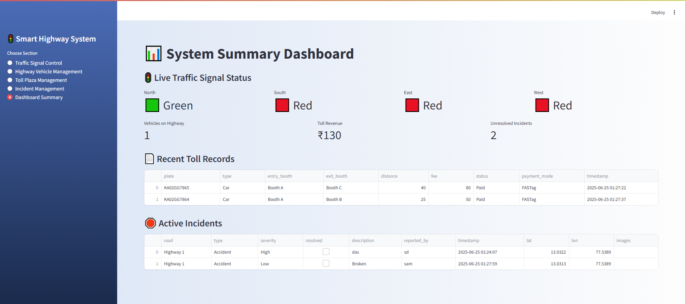
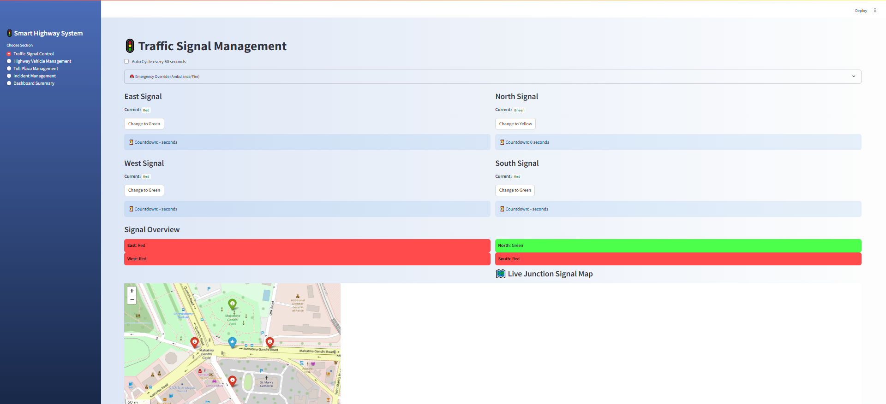
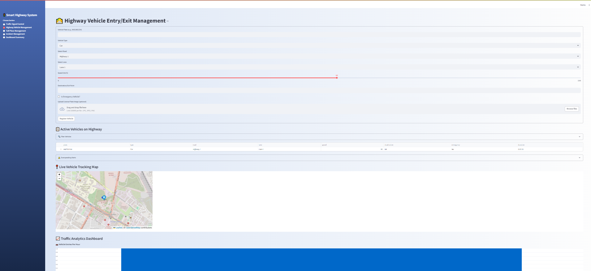
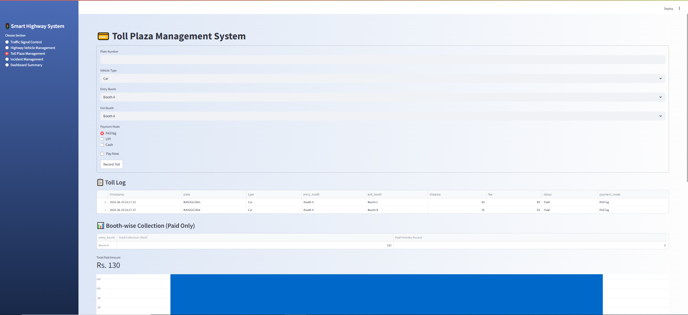
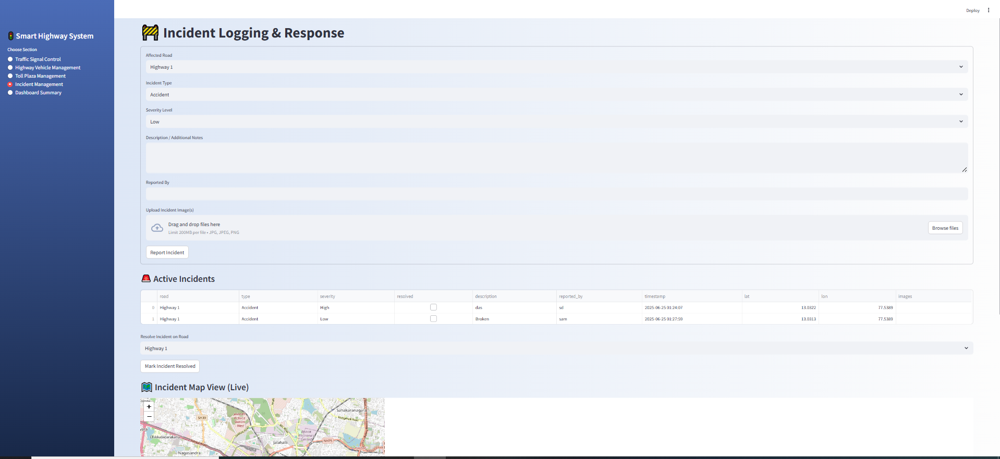

# 🚦 Smart Traffic & Toll Management System

An integrated and intelligent highway monitoring system built with **Streamlit**, offering real-time vehicle tracking, automated toll calculation, incident logging, and AI-based traffic signal control — all in one dashboard.

---

## 📸 Preview








---

## 🌟 Features

### 🛣️ Highway Vehicle Management
- Real-time vehicle registration with OCR for plate recognition
- Overspeeding alerts with audio warning
- Emergency vehicle detection
- Live tracking map using **Folium**

### 💳 Toll Plaza Management
- Auto toll fee calculation based on entry/exit booth distance
- PDF receipt generator with downloadable button
- Admin dashboard with booth-wise collection & congestion indicators

### 🚦 Traffic Signal Control
- Manual and auto signal cycling every 60 seconds
- Emergency override for ambulances/fire
- Signal status visualized on map and in summary dashboard

### 🚧 Incident Management
- Log road incidents with image upload
- Severity-based toast & email notifications
- Incident location mapped on highway (color-coded markers)
- Timeline of incidents with resolution status

### 📊 Dashboard Summary
- Metrics for vehicle count, toll revenue, unresolved incidents
- Current traffic light status for all 4 directions
- Booth queues, traffic analytics, and more

---

## 🖥️ Technologies Used

| Technology       | Purpose                                         |
|------------------|--------------------------------------------------|
| **Streamlit**     | Frontend + backend dashboard engine             |
| **Python**        | Backend scripting and logic                     |
| **Folium**        | Map visualizations for vehicles & incidents     |
| **FPDF**          | Receipt generation as downloadable PDFs         |
| **Pandas**        | Data handling and display in dashboard          |
| **Pytesseract**   | OCR-based license plate reading (optional)      |
| **SMTP (Email)**  | Sending severity-based incident alerts          |

---

## ⚙️ How to Setup This Project Locally

### 1️⃣ Clone the Repository
```bash
git clone https://github.com/sadath1913/Smart-Highway-Management-.git
cd smart-traffic-management

### 2 Create Virtual Environment
python -m venv env
source env/bin/activate  # Windows: env\Scripts\activate

##3️⃣ Install Requirements
pip install -r requirements.txt

##4️⃣ Setup Email Secrets
Create a .streamlit/secrets.toml file:

[email]
sender = "your_email@gmail.com"
password = "your_app_password"
receiver = "destination_email@gmail.com"

##5️⃣ Run the App

streamlit run app.py
